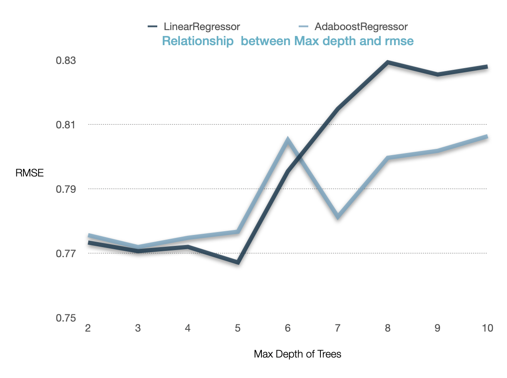

# Introduction
Now more than ever, people do not step foot into a restaurant without copious amounts of research on the internet. Particularly evident in a tourist-friendly city like Las Vegas, restaurant owners continually search for the perfect combination of offerings that will make consumers give them a good review. An investment in better reviews will hopefully lead to a greater influx of consumers. Our study focuses on Yelp, which is rated the most frequented review site. We hope to identify the key factors that contribute to restaurants obtaining a higher score in Las Vegas. By predicting the review score after particular investments, we will help restaurant owners direct their future investments. 

# Visualizing the Data

  
   

These graphs show that the majority of our data points come from the Las Vegas Strip. It should be noted that our findings are localized to that area.

---
# Cleaning and Pre-processing the Data
## Yelp Dataset -> Las Vegas Restaurant Dataset
The original dataset contained information on 209,393 businesses, not just restaurants, that were found across 11 different metropolitan areas of the world. The data for each business contained the field: **category**. It was determined that to narrow our data to only include information on restaurants, retaining the businesses that contained *Restaurant* or *food* in the *category* field would be acceptable. 

The resulting dataset contained information on 42,152 businesses that presumably all sold food to their customers. In order for the location of these restaurants to not affect the results of any machine learning modeling, it was decided to focus on restaurants contained in only one city. The top 5 cities by count of restaurants is shown below. 

| City | Number of Restaurants|
| :---: | :---:|
|Toronto | 5481 | 
|Las Vegas | 5192| 
|Phoenix | 3133 | 
|Charlotte | 2201 | 
|Montreal | 2013 | 

The decision was made to study a city in the United States so Las Vegas became the location of choice and the dataset was further filtered. 
## Cleaning the Las Vegas Restaurant Dataset
The two main concerns with the restuarant data that needed to be addressed were the completeness of each feature in the dataset and the completeness of each restaurant's data in the dataset. The following procedure was used to clean the data as much as possible. 
1. Features with less than 15% completeness were eliminated from the dataset. Eliminated features are shown below:

    + By Appointment Only
    + Coat Check
    + Drive Thru
    + Smoking
    + Dogs Allowed
    + BYOB
    + Happy Hour
    + Corkage
    + Business Accepts Bitcoin
    + Ages Allowed
    + Accepts Insurance
    + Dietary Restrictions
    + Music
    + Counter Service
    + Best Nights
    + Open 24 Hours
    + Good For Dancing
    + Hair Specializes In

2. Restaurants with less than 80% completeness of data were discarded. 
  
    + Number of Restaurants Kept: 17737
    + Number of Restaurants Eliminated: 24415

3. Features with less than 80% completeness were eliminated from the dataset. Eliminated features are shown below: 

    + Business Accepts Credit Cards
    + Wheelchair Accesible
    + Good for Meal
    + Restaurants Table Service

4. Features that could not be transformed into values that a machine learning model could use as data were deleted next. Eliminated feature are shown below:

    + Name
    + Business Parking
    + Address 
    + Categories 
    + City 
    + Hours 
    + State 
    + Business Id

## Feature Selection
The resulting dataset contained information about 2,503 different restaurants in the Las Vegas area, with each restaurant consisting of data from 22 different features. In order to reduce the number of features in our dataset even further, a correlation matrix was created to determine the relationship between various features and eliminate features with weak correlations to our label. 

Some features like *Good for Groups* and *Good for Kids*, which seemed like they would logically have some influence on the rating of a restaurant, ultimately had very little correlation to the number of stars a restaurant recieved. Features, like the *Ambience* and *Price Range* of the restaurant, were suspected of being indicators of the reating of a restaurant. The correlation matrix confirmed that these features had a stronger correlation to the number of stars a restaurant has than other features. An absolute value of a correlation greater than 0.1 was set as the cut off for which features will be kept in the dataset. 

To further reduce the number of features in the dataset, the overall correlation matrix was analyzed in order to determine if any features were strongly related to one or another. If one feature had a strong correlation to another feature, one of them could be discarded and the variance in the data would not decrease significantly. 

The strongest correlation between two features is found to be 0.58 between *Alcohol* and *Price Range*. However, no two features seem correlated enough to each other to reasonably leave them out of the dataset, so no changes are made. 

The final dataset consists of 11 features and 2,503 restaurants. The corresponding label for each restaurant is the star rating they have recieved in yelp. 

---

# Methods
A supervised learning approach for predictive data analysis, specifically tree-based models and regression, were utilized. 

+ Regression: Linear Regression and Ridge Regression
+ Tree-based Models: Decision Tree and Random Forest

The Sci-kit learn packages for the chosen regression and tree-based models were used. A 70 - 30 split was used in order to split the data into a training set and a testing set. 

# PCA/Regression
We first used PCA to try and find the optimal variable to begin our regression. However, upon further review, the first principal component was only able to explain 32% of the data. The second principal component explained 19% of the data. The following graph follows:

We hypothesized after about six principal components, the rmse of the linear regression would flatten, since that is when the explained variance reaches negligible levels. As expected: the graph of the linear rmse against the number of k components and the ridge rmse against the number of k components follow:

  
   

The rmse's of both regressions were similar, at 1.48086 for linear and 1.48096 for ridge. For data in the range [1,10], these errors are very high. We can conclude that neither regression is accurate in predicting the data, but one does not perform significantly better than the other.

# Decision Tree

In this method, we wanted to see if a regressor being could yield a better result based on the continous nature of the Stars ratings. With that, we had to drop PostalCode as a feature as it wouldn't fit the nature of the prediction model. 

For decision trees, we used the scikit implementation of the regression model and attempted two variations:

1. Maximum Depth allowed in the tree
2. Boosting the Tree

 ## Maximum Depth of Trees and Stablizing

Maximum Depth: At first, we experimented with a depth level of 10 and observed how the calculate errors began to go down till it hit a minimum of 0.767078 at the max depth of 5 trees. We decided to use this max depth for both DecisionTreeRegressor and AdaboostRegressor to maintain consistency and because the difference between the AdaboosRegressor min and what was shown at max depth of 5 trees was minimal.

We used RMSE for calculating error. Used r2_score for calculating variance.

We used the Adaptive Boosting (AdaBoost) regressor (scikit implementation) that is essentially increasing the weight of misclassified data points and updating,  then making a new prediction by by adding the weights of each tree times the  prediction of each tree. We hypothesized that boosting would lower our rmse. We used the maximum depth that was used in the previous model to see if boosting had actually improved the model.

As seen, the boosting did help reduce error, although not significantly. Other methods like pruning were attempted but the tree proved too sensitive to run many of the pruning methods. 

Despite the Adaboost regressor yielding better results, we feared that the decision tree regression had overfit the data so we decided to see if a classification of the star ratings in a random forest classifier would yield better results.

# Decision Tree Take 2

| Type | Accuracy|
| :---: | :---:|
|Multi-Class Label | 24.28 | 
|Binary Label | 74.35 | 

# Random Forest Classifier

When running the Random Forest Classifier on the dataset, three parameters were chosen to be explored in determining their effect on the accuracy of the model. The three parameters were: 

1. The number of trees in the forest
2. The criterion for deciding the split when building a tree
3. The maximum depth for each of the trees in the forest

### Number of Trees in the Forest

From the plot above, there seems to be a rise in accuracy from around 21% to around 27% when raising the number of trees in the forest from 1 to 20. After that point, the accuracy oscillates by approximately a percent around 26%, indicating that additional trees do not impact the accuracy of the Random Forest. 

### Split Criterion

The two splitting criterion that Random Forest Classifier can use are the Gini Impurity and Information Gain Entropy. The number of trees in the model were varied in order to see if any differences in accuracy could be maintained. From the plot above, there seems to be no relationship between the accuracy of the Random Forest model and the splitting criterion it utilizes. 

### Maximum Depth of Trees

A range from 10-100 was examined for the maximum depth of a tree and its effect on the accuracy of the model. The model's accuracy seems to peak at around a depth of 10, before stabilizing around 27 %. Perhaps by minimizing the depth of the tree, the model avoids overfitting the training data and creates better predictions. 

### Results

A Random Forest Classifier was run with the following parameters: 

| Parameter | Value |
| :---: | :---:|
| Number of Trees | 30|
| Criterion | Entropy | 
| Max Depth | 10 |

The resulting accuracy was 28.9%. This poor accuracy is likely a result of the way the accuracy is being calculated. As there are 10 different labels, a high accuracy would mean the model is able to differentiate between all of the labels well. Perhaps creating a model that can predict the star rating of a restaurant to that degree of accuracy isn't plausible with the current data. 

In order to test this theory, the labels for the dataset were adjust to be binary labels. A star rating of 2.5 or less was labeled a *Bad Restaurant* and a star rating of greater than 2.5 was labeled a *Good Restaurant*. The Random Forest Classifier was run over a range of a number of trees using the entropy criterion for splitting and a maximum depth per tree of 10. The results are shown below: 

### Results

We modelled various Machine Learning Models to predict Yelp star reviews in the city of Las Vegas. Our observations were the following:

a) The real life dataset was noisy and incomplete, and often require a lot of cleaning up. In our case, we removed restaurants and features that did not have at least the majority of the information given.

b) The dataset was reasonably accurately portayed using six principal components. Regardless of which type, regression was not an accurate way to predict the data.

c) .

d) .

We unfortunately did not get the strict results that we were expecting, in which we could tell a resturant owner to fix x, y, and z to improve their ratings. If anything, this goes to show that consumers in Las Vegas expect a well-rounded experience. Restaurant owners should take care to offer the same amentities as their competitors to give themselves the best chance at high rating.

### References

Wright, Lindsey, "Classifying textual fast food restaurant reviews quantitatively using text mining and supervised machine learning algorithms" (2018). Undergraduate Honors Theses. Paper 451. https://dc.etsu.edu/honors/451

Fan, Mingming & Khademi, Maryam. (2014). Predicting a Business Star in Yelp from Its Reviews Text Alone. 

Ahmed AM, Rizaner A, Ulusoy AH (2018) A novel decision tree classification based on post-pruning with Bayes minimum risk. PLoS ONE 13(4): e0194168. https://doi.org/10.1371/journal.pone.0194168

Yang, Sung-Byung & Hlee, Sunyoung & Koo, Chulmo. (2017). An empirical examination of online restaurant reviews on Yelp.com: A dual coding theory perspective. International Journal of Contemporary Hospitality Management. 29. 817-839. 10.1108/IJCHM-11-2015-0643. 

