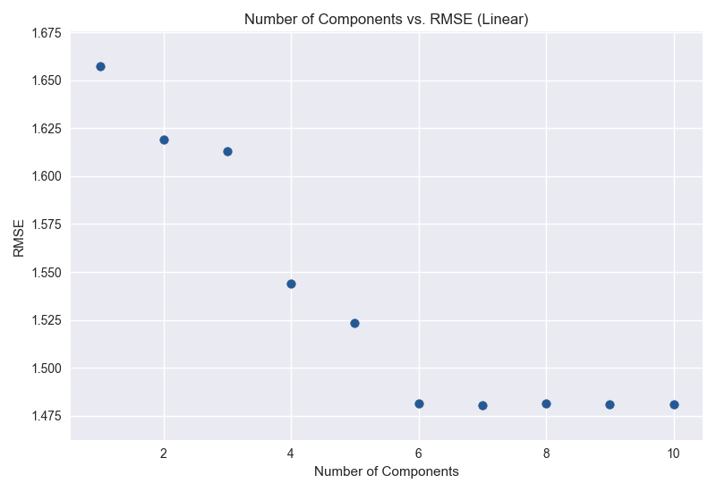

# Introduction
Now more than ever, people do not step foot into a restaurant without copious amounts of research on the internet. Particularly evident in a tourist-friendly city like Las Vegas, restaurant owners continually search for the perfect combination of offerings that will make consumers give them a good review. An investment in better reviews will hopefully lead to a greater influx of consumers. Our study focuses on Yelp, which is rated the most frequented review site. We hope to identify the key factors that contribute to restaurants obtaining a higher score in Las Vegas. By predicting the review score after particular investments, we will help restaurant owners direct their future investments. 

# Visualizing the Data

  
   

---
# Cleaning and Pre-processing the Data
## Yelp Dataset -> Las Vegas Restaurant Dataset
The original dataset contained information on 209,393 businesses, not just restaurants, that were found across 11 different metropolitan areas of the world. The data for each business contained the field: **category**. It was determined that to narrow our data to only include information on restaurants, retaining the businesses that contained *Restaurant* or *food* in the *category* field would be acceptable. 

The resulting dataset contained information on 42,152 businesses that presumably all sold food to their customers. In order for the location of these restaurants to not affect the results of any machine learning modeling, it was decided to focus on restaurants contained in only one city. The top 5 cities by count of restaurants is shown below. 

| City | Number of Restaurants|
| :---: | :---:|
|Toronto | 5481 | 
|Las Vegas | 5192| 
|Phoenix | 3133 | 
|Charlotte | 2201 | 
|Montreal | 2013 | 

The decision was made to study a city in the United States so Las Vegas became the location of choice and the dataset was further filtered. 
## Cleaning the Las Vegas Restaurant Dataset
The two main concerns with the restuarant data that needed to be addressed were the completeness of each feature in the dataset and the completeness of each restaurant's data in the dataset. The following procedure was used to clean the data as much as possible. 
1. Features with less than 15% completeness were eliminated from the dataset. Eliminated features are shown below:

    + By Appointment Only
    + Coat Check
    + Drive Thru
    + Smoking
    + Dogs Allowed
    + BYOB
    + Happy Hour
    + Corkage
    + Business Accepts Bitcoin
    + Ages Allowed
    + Accepts Insurance
    + Dietary Restrictions
    + Music
    + Counter Service
    + Best Nights
    + Open 24 Hours
    + Good For Dancing
    + Hair Specializes In

2. Restaurants with less than 80% completeness of data were discarded. 
  
    + Number of Restaurants Kept: 17737
    + Number of Restaurants Eliminated: 24415

3. Features with less than 80% completeness were eliminated from the dataset. Eliminated features are shown below: 

    + Business Accepts Credit Cards
    + Wheelchair Accesible
    + Good for Meal
    + Restaurants Table Service

4. Features that could not be transformed into values that a machine learning model could use as data were deleted next. Eliminated feature are shown below:

  + Name
  + Business Parking
  + Address 
  + Categories 
  + City 
  + Hours 
  + State 
  + Business Id

---

# Methods
We used a supervised learning approach for predictive data analysis, and utilized tree-based models and regression.

Regression: Linear Regression and Ridge Regression
Tree-based Models: Decision Tree and Random Forest

# PCA/Regression
We first used PCA to try and find the optimal variable to begin our regression. However, upon further review, the first principal component was only able to explain BLANK% of the data. The second principal component explained BLANK% of the data. The following graph follows:

Ishita to do: insert graph #k vs explained_variance

We hypothesized after about six principal components, the rmse of the linear regression would flatten, since that is when the explained variance reaches negligible levels. As expected: the graph of the linear rmse against the number of k components follows:

Running the data through a Ridge Regression follows the same trend:

The rmse's of both regressions were similar and very high, so we can conclude that both regressions are equally bad at predicting the data.
(Ishita to do: Say this better and add specific RMSE's)

However, we can conclude that 6 principal components is that smallest number that still represents the data at an acceptable level.

Ishita to do maybe: Graph breakdown of features that make these up.

