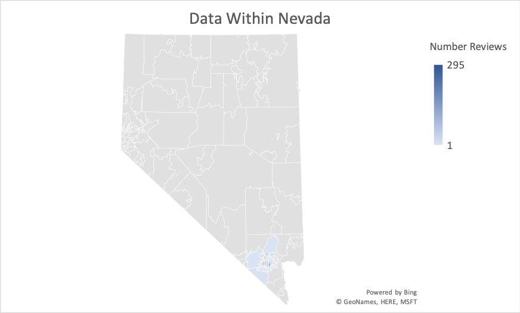
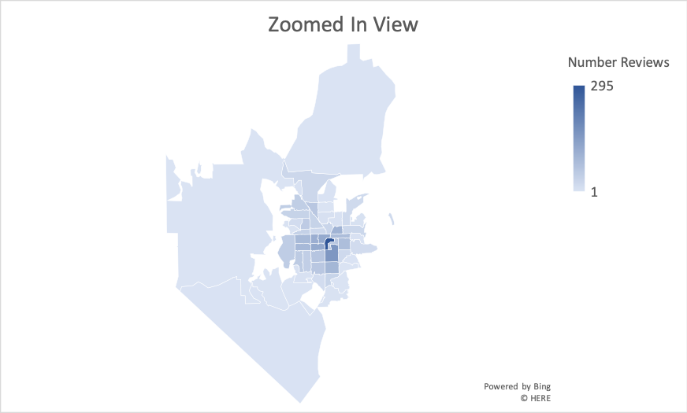
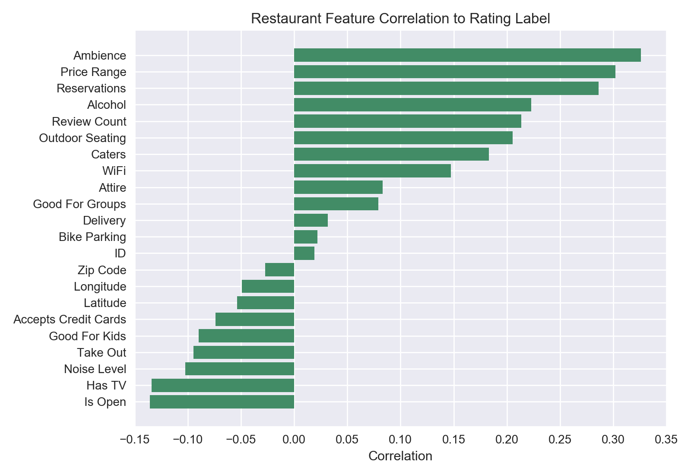
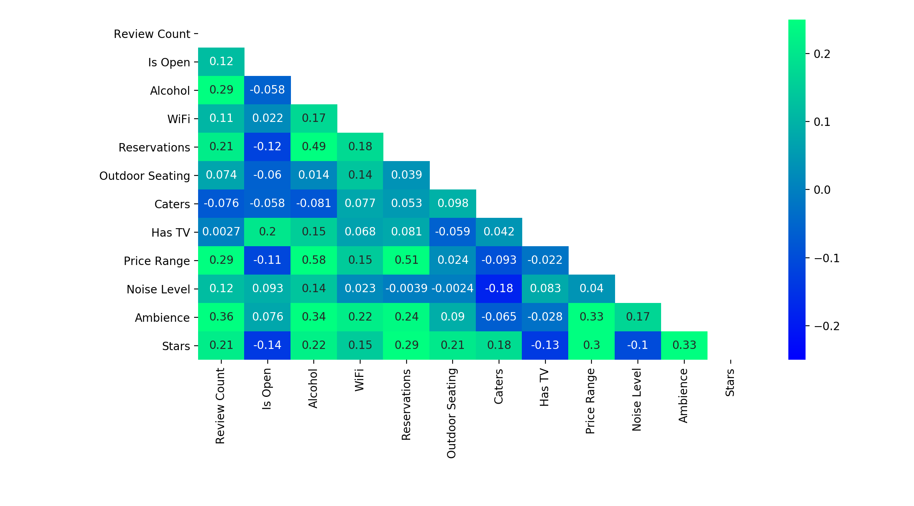
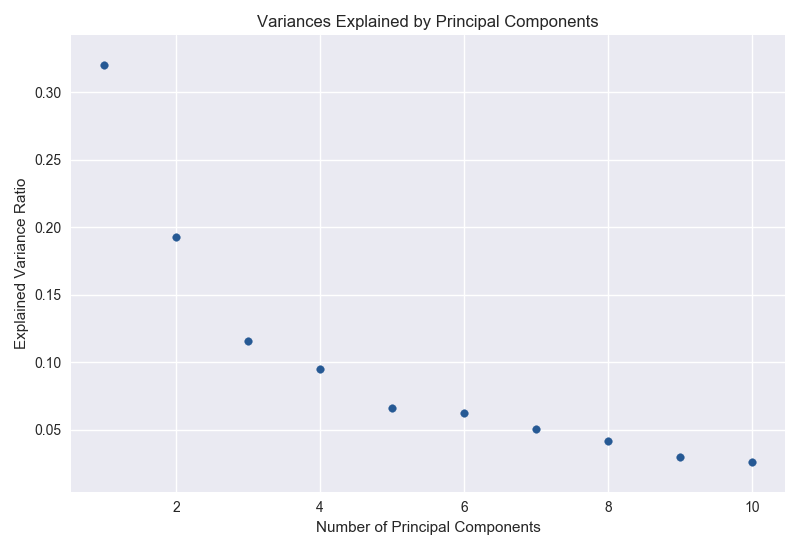
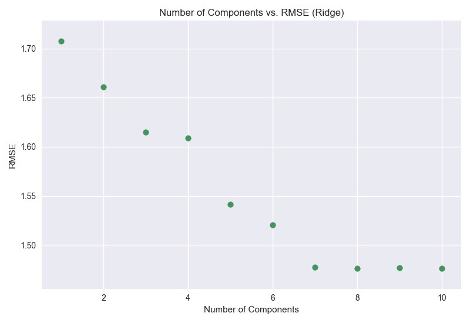
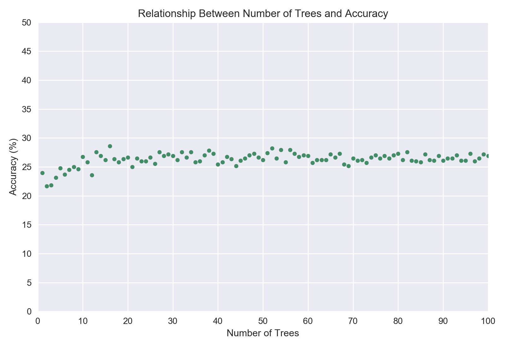
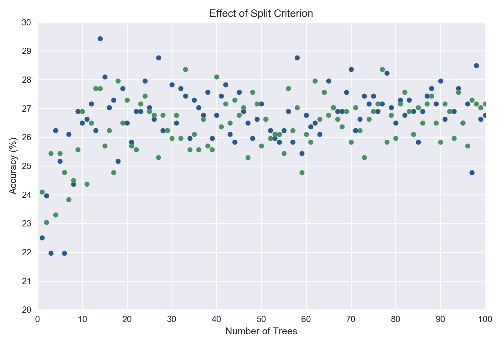
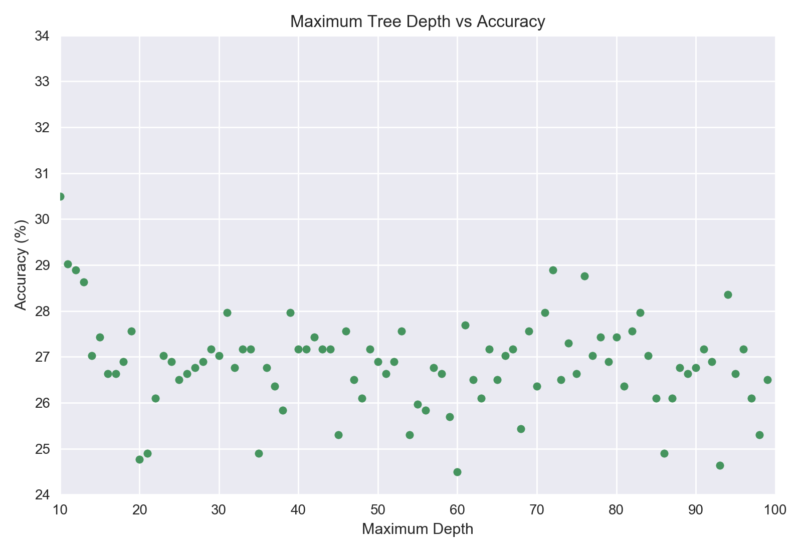
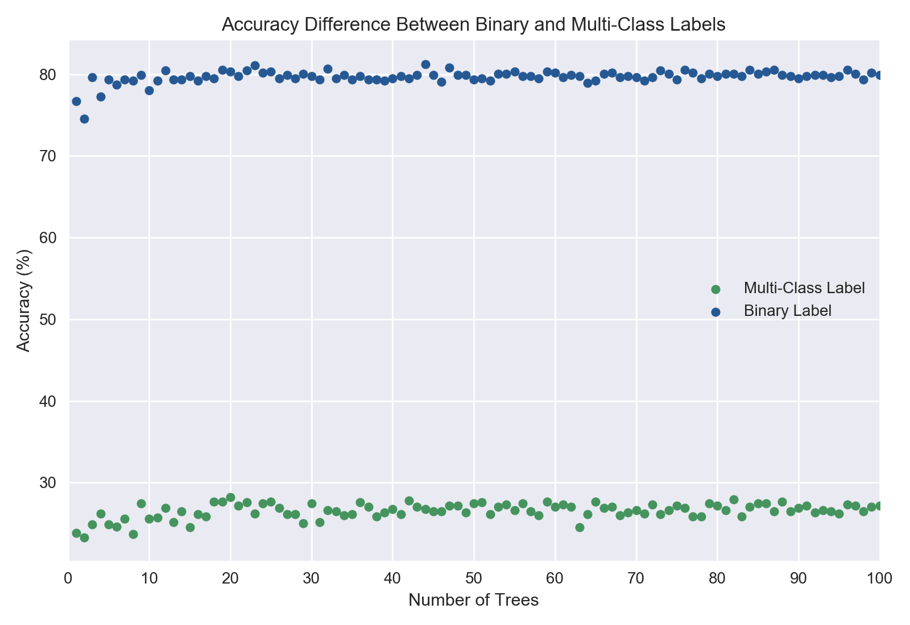

# Introduction
Now more than ever, people do not step foot into a restaurant without copious amounts of research on the internet. Particularly evident in a tourist-friendly city like Las Vegas, restaurant owners continually search for the perfect combination of offerings that will make consumers give them a good review. An investment in better reviews will hopefully lead to a greater influx of consumers. Our study focuses on Yelp, which is rated the most frequented review site. We hope to identify the key factors that contribute to restaurants obtaining a higher score in Las Vegas. By predicting the review score after particular investments, we will help restaurant owners direct their future investments. 

# What People Have Already Done?
Text mining has been used significantly in attempting to generate a quantitative value based on the opinion written by the customers reviews using manual clustering for data  preparation as well as decision tree and random forest classifiers for the methods [4, 5]. Furthermore, other studies generated a bag of words and used regression problems using linear regression, support vector regression, support vector regression, and decision tree regression [3]. Other studies used decision tree classifiers post-pruning that could produce better classification accuracy [1]. Closest to our goal was an attempt at predicting general restaurant reviews through similar features using neural network analysis although they focused on sales performance as well [2].

# Visualizing the Data

  
   

These graphs show that the majority of our data points come from the Las Vegas Strip. It should be noted that our findings are localized to that area.

---
# Cleaning and Pre-processing the Data
## Yelp Dataset -> Las Vegas Restaurant Dataset
The original dataset contained information on 209,393 businesses, found across 11 different metropolitan areas of the world. We trimmed our dataset to only contain information about restaurants. We deleted businesses in the dataset that did not contain *Restaurant* or *food* in the **category** feature of our dataset. 

The resulting dataset contained information on 42,152 restaurants. We decided to focus on restaurants contained in only one city. The top 5 cities by count of restaurants is shown below. 

| City | Number of Restaurants|
| :---: | :---:|
|Toronto | 5481 | 
|Las Vegas | 5192| 
|Phoenix | 3133 | 
|Charlotte | 2201 | 
|Montreal | 2013 | 

We decided to keep the dataset in the United States so Las Vegas was chosen as the location to further filter our data. 

## Cleaning the Las Vegas Restaurant Dataset
We found that the main concerns with the dataset were the completeness of each feature and the completeness of each restaurant's dataset. After parsing the data, 63% of the features were deleted because there wasn't enough data and 52% of the restaurants in the dataset were cut for the same reason. 
    
## Feature Selection
The resulting dataset contained information about 2,503 different restaurants in the Las Vegas area, with 22 different features each. To reduce the number of features we created a correlation matrix to examine relationships between our features and our label.  

Some features like *Good for Groups* and *Good for Kids*, which seemed like they would have some influence on the rating of a restaurant, ultimately had very little correlation to the number of stars a restaurant recieved. Other features, like *Ambience* and *Price Range*, were confirmed of having a stronger correlation to the number of stars a restaurant recieves. We set the cut off for which features will be kepty in the dataset at the absolute value of a correlation greater than 0.1. 

We used the full correlation matrix to analyze the correlation between features and see if the number of features could be further reduced.

We found that the strongest correlation between two features is only 0.58 between *Alcohol* and *Price Range*. We didn't believe any two features seemed correlated enough to each other leave them out of the dataset, so no changes were made. 

The final dataset consists of 11 features and 2,503 restaurants. The corresponding label for each restaurant is the star rating they have recieved in Yelp. 

---

# Methods
A supervised learning approach for predictive data analysis, specifically tree-based models and regression, were utilized. 

+ Regression: Linear Regression, Ridge Regression, and Lasso Regression
+ Tree-based Models: Decision Tree and Random Forest

The Sci-kit learn packages for the chosen regression and tree-based models were used. A 70 - 30 split was used in order to split the data into a training set and a testing set. 

# PCA/Regression
We first used PCA to try and find the optimal variable to begin our regression. However, upon further review, the first principal component was only able to explain 32% of the data. The second principal component explained 19% of the data. The following graph follows:

We hypothesized after about six principal components, the rmse of the linear regression would flatten, since that is when the explained variance reaches negligible levels. As expected: the graph of the linear rmse against the number of k components and the ridge rmse against the number of k components follow:

  
   

As the Lasso regression works similarly to dimensionality reduction, it did not make sense to run it with different numbers of k components.

### Results

| Type | RMSE Value|
| :---: | :---:|
|Linear | 1.48086 | 
|Ridge | 1.48096 | 
|Lasso | 1.70771 | 

For data in the range [1,10], these errors are very high. We can conclude that none of these regressions are accurate in predicting the data, but the linear and ridge are the best candidates.

# Decision Tree Classifier

We wanted to explore running a classification model on our data to see if restaurants could be split into their star ratings based on their data. The Decision Tree Classifier was chosen as a model to run to create a baseline for the Random Forest Classifier. Generally, Random Forest Classifiers are more robust models than Decision Tree Classifiers. Using the default parameters for the Sci kit learn Decision Tree Classifier model, an accuracy of 24% was found. 

We think this poor accuracy is likely a result of the way the accuracy is being calculated. With 10 different labels, a high accuracy indicates the model can differentaiate between all the labels well. We think that constructing a model that can predict the star rating of a restaurant to that degree of accuracy isn't plausible with the current data.

In order to test this theory, we adjusted the labels for the dataset to become binary labels. We assigned a label of *Bad Restaurant* to a star rating of 2.5 or less, *Good Restaurant* to a star rating of greater than 2.5. We found that using Binary labels greatly increased the accuracy of our models. 

| Type | Accuracy|
| :---: | :---:|
|Multi-Class Label | 24.28 | 
|Binary Label | 74.35 | 

# Random Forest Classifier

We decided to explore three parameters and their effect on the accuracy of the Random Forest Classifier model on our dataset. 

1. The Number of Trees in the Forest
2. The Splitting Criterion
3. The Maximum Depth of a Tree

### Number of Trees in the Forest

From the plot above, we found that there is a rise in accuracy from around 22% to around 27% when raising the number of trees in the forest from 1 to 20. After that point, the accuracy oscillates by approximately a 1% around 26%, indicating that additional trees do not impact the accuracy of the Random Forest. 

### Split Criterion

The two splitting criterion that the Random Forest Classifier can use are the Gini Impurity and Information Gain Entropy. We varied the number of trees in the model to see if there were consistent differences in accuracy. From the plot above, we found that there is no relationship between the accuracy of the model and the splitting criterion. 

### Maximum Depth of Trees

We examined a range from 10-100 for the maximum depth of a tree and its effect on the accuracy of the model. The model's accuracy peaks at around a depth of 10, before stabilizing around 27%. We think that by minimizing the depth of the tree, the model avoids overfitting the training data and creates better predictions. 

### Results

A Random Forest Classifier was run with the following parameters: 

| Parameter | Value |
| :---: | :---:|
| Number of Trees | 30|
| Criterion | Entropy | 
| Max Depth | 10 |

The resulting accuracy was 29.63%. Similar to the Decision Tree Classifier, the Random Forest Classifier model was constructed using binary labels. We then ran the model over a range of a number of trees using the optimized parameters. The results of the binary model compared to the multi-classification model are shown below. 

As expected, we found that the binary model is much more accurate than the multi-classification model. Also, the Random Forest Classifier was more accurate than the Decison Tree Classifier regardless of the type of label being used. 

# Conclusion

We modeled various Machine Learning Models to predict Yelp star reviews in the city of Las Vegas. Our observations were the following:

a) The real life dataset was noisy and incomplete, and often require a lot of cleaning up. In our case, we removed restaurants and features that did not have at least the majority of the information given.

b) The dataset was reasonably accurately portayed using six principal components. Regardless of which type, regression was not an accurate way to predict the data.

c) The Random Forest Classifier performed slightly better than the Decision Forest Classifier as expected. However, both classification models performed poorly when attempting to predict star ratings. Binary classification improved the model's accuracy but shows the limitations of our models.   

We unfortunately did not get the strict results that we were expecting, in which we could tell a resturant owner to fix x, y, and z to improve their ratings. If anything, this goes to show that consumers in Las Vegas expect a well-rounded experience. Restaurant owners should take care to offer the same amentities as their competitors to give themselves the best chance at high rating.

# References

[1] Ahmed AM, Rizaner A, Ulusoy AH (2018) A novel decision tree classification based on post-pruning with Bayes minimum risk. PLoS ONE 13(4): e0194168. https://doi.org/10.1371/journal.pone.0194168

[2] Chong, Alain Yee Loong, et al. “Predicting Online Product Sales via Online Reviews, Sentiments, and Promotion Strategies.” International Journal of Operations & Production Management, vol. 36, no. 4, 2016, pp. 358–383., doi:10.1108/ijopm-03-2015-0151.

[3] Fan, Mingming & Khademi, Maryam. (2014). Predicting a Business Star in Yelp from Its Reviews Text Alone. 

[4] Lunkad, Kartik. (2015). Prediction of Yelp Rating using Yelp Reviews. 

[5] Wright, Lindsey, "Classifying textual fast food restaurant reviews quantitatively using text mining and supervised machine learning algorithms" (2018). Undergraduate Honors Theses. Paper 451. https://dc.etsu.edu/honors/451

